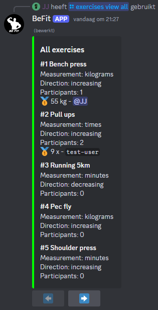
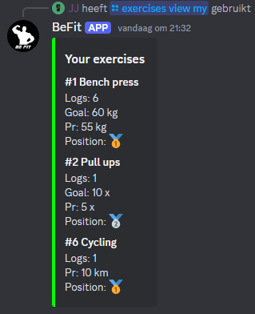
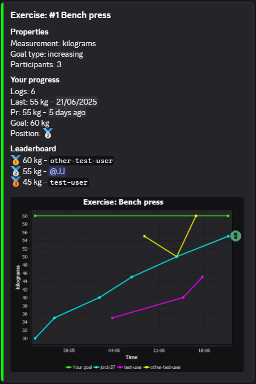
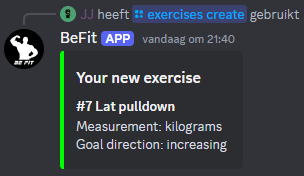
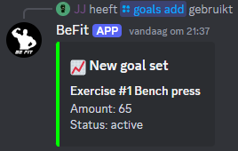
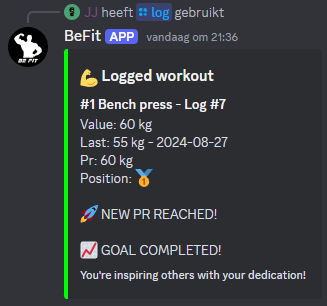
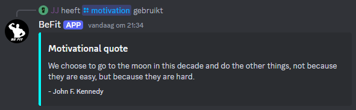
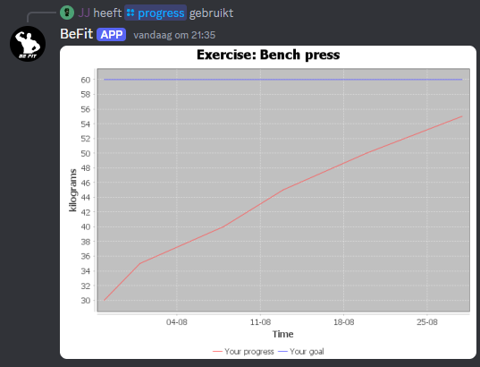

# BeFit
This cool bot can help you with improving your fitness. It can track your progress, motivate you, manage your goals and compare your progress to others.

## Discord
### Global Commands

  
View all exercises

  
  >Format: `/exercises view all` \
  >Example: \
  >
  

  
View the exercises you are participating in

  
  >Format: `/exercises view my` \
  >Example: \
  >
  

  
View extended data of a single exercise

  
  >Format: `/exercises view one {exercise-name}` \
  >Example: \
  >

  
Create a new exercise type

  
  >Format: `/exercises create {name} {measurement-type} {goal-direction}` \
  >Example: \
  >

  
Create a new goal for yourself

  
  >Format: `/goals add {exercise-name} {amount}` \
  >Example: \
  >

  
Log an exercise

  
  >Format: `/log {exercise-name} {amount}` \
  >Example: \
  >

  
Retrieve a random motivational quote

  
  >Format: `/motivation` \
  >Example: \
  >

  
View your progress on an exercise

  
  >Format: `/progress {exercise-name} ?{view-mode}` \
  >Example: \
  >

### Management Commands

  
Restart server

  >Format: `/management restart`

  
Refresh guild commands

  >Format: `/management refresh`

  
Add scheduled job

  >Format: `/management jobs add {channel-id} {job-type} {cron-expression} ?{timezone-id}`

  
Remove scheduled job

  >Format: `/management jobs remove {scheduled-job}`

## Deployment
### Docker
Follow the instructions as mentioned in the [how-to](docs/how-to-run-on-docker.md)

### RaspberryPi
Follow the instructions as mentioned in the [how-to](docs/how-to-run-on-raspberrypi-using-docker.md)
