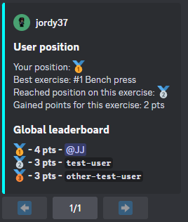
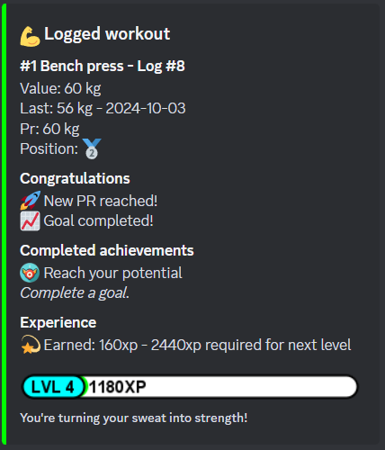
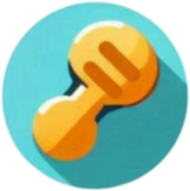

[](https://github.com/jordybronowicki37/befit-bot/releases)
[](https://github.com/jordybronowicki37/befit-bot/tags)
[](https://github.com/jordybronowicki37)

```
██████╗ ███████╗███████╗██╗████████╗
██╔══██╗██╔════╝██╔════╝██║╚══██╔══╝
██████╔╝█████╗  █████╗  ██║   ██║   
██╔══██╗██╔══╝  ██╔══╝  ██║   ██║   
██████╔╝███████╗██║     ██║   ██║   
╚═════╝ ╚══════╝╚═╝     ╚═╝   ╚═╝   
```

# BeFit gains tracker
This cool bot can help you with improving your fitness. It can track your progress, motivate you, manage your goals and compare your progress to others.

## Discord
### Global Commands
<details>
  <summary>Achievements</summary>
  
  >Format: `/achievements` \
  >Example: \
  >
  
</details>

<details>
  <summary>View all exercises</summary>
  
  >Format: `/exercises view all` \
  >Example: \
  >
  
</details>

<details>
  <summary>View the exercises you are participating in</summary>
  
  >Format: `/exercises view my` \
  >Example: \
  >
  
</details>

<details>
  <summary>View extended data of a single exercise</summary>
  
  >Format: `/exercises view one {exercise-name}` \
  >Example: \
  >

</details>

<details>
  <summary>Create a new exercise type</summary>
  
  >Format: `/exercises create {name} {measurement-type} {goal-direction}` \
  >Example: \
  >

</details>

<details>
  <summary>Create a new goal for yourself</summary>
  
  >Format: `/goals add {exercise-name} {amount}` \
  >Example: \
  >

</details>

<details>
  <summary>Remove an existing goal</summary>
  
  >Format: `/goals remove {goal}`

</details>

<details>
  <summary>View your goals</summary>
  
  >Format: `/goals view` \
  >Example: \
  >

</details>

<details>
  <summary>Help</summary>
  
  >Format: `/help` \
  >Example: \
  >

</details>

<details>
  <summary>Leaderboard</summary>
  
  >Format: `/leaderboard` \
  >Example: \
  >

</details>

<details>
  <summary>Log history</summary>
  
  >Format: `/history` \
  >Example: \
  >

</details>

<details>
  <summary>Log an exercise</summary>
  
  >Format: `/log {exercise-name} {amount}` \
  >Example: \
  >

</details>

<details>
  <summary>Retrieve a random motivational quote</summary>
  
  >Format: `/motivation` \
  >Example: \
  >

</details>

<details>
  <summary>View your progress on an exercise</summary>
  
  >Format: `/progress {exercise-name} ?{view-mode}` \
  >Example: \
  >

</details>

<details>
  <summary>User stats</summary>

  >Format: `/stats` \
  >Example: \
  >

</details>

### Management Commands
<details>
  <summary>Restart server</summary>

  >Format: `/management restart`

</details>

<details>
  <summary>Refresh guild commands</summary>

  >Format: `/management refresh`

</details>

<details>
  <summary>Add scheduled job</summary>

  >Format: `/management jobs add {channel-id} {job-type} {cron-expression} ?{timezone-id}`

</details>

<details>
  <summary>Remove scheduled job</summary>

  >Format: `/management jobs remove {scheduled-job}`

</details>

## Achievements
There are 20 achievements for you to complete.

<details>
  <summary>Achievements</summary>

  > 
  > 
  > | Icon                                                                          | Title                   | Description                                                                               | Difficulty |
  > |-------------------------------------------------------------------------------|-------------------------|-------------------------------------------------------------------------------------------|------------|
  > |  | Heart monitor           | Log an exercise which uses bpm as a measurement.                                          | EASY       |
  > |  | Lets get healthy        | Create your first log.                                                                    | EASY       |
  > |  | Reach your potential    | Complete a goal.                                                                          | EASY       |
  > |  | Cardio enthusiast       | Do any exercise for 30 minutes.                                                           | MEDIUM     |
  > |  | Done for today          | Create 10 logs on a single day.                                                           | MEDIUM     |
  > |  | Full workout            | Within 24h log an exercise for the following categories: weight, time and distance based. | MEDIUM     |
  > |  | Keep on stacking        | Have 5 concurrent logs of a single exercise that keep increasing.                         | MEDIUM     |
  > |  | Love to lift            | Lift something weighing more than 50kg for 3 days in a row.                               | MEDIUM     |
  > |  | On a roll               | Log an exercise 4 days in a row.                                                          | MEDIUM     |
  > |  | The right mindset       | Set 5 goals and complete these within a month.                                            | MEDIUM     |
  > |  | Think about your health | Log an exercise that burns 200 calories.                                                  | MEDIUM     |
  > |  | Feels like home         | Log an exercise 10 days in a row.                                                         | HARD       |
  > |  | Lets go places          | Reach a distance on any exercise of 20km.                                                 | HARD       |
  > |  | Show off                | Reach the first place on an exercise leaderboard that has at least 6 participants.        | HARD       |
  > |  | The goat                | Create a total of 100 logs.                                                               | HARD       |
  > |  | The hulk                | Lift something weighing more than 100kg.                                                  | HARD       |
  > |  | Like a marathon         | Reach a distance on any exercise of 42km.                                                 | IMPOSSIBLE |
  > |  | Serious dedication      | Create logs each day for an entire month.                                                 | IMPOSSIBLE |
  > |  | Bodybuilder             | WIP                                                                                       | UNKNOWN    |
  > |  | On the bench            | WIP                                                                                       | UNKNOWN    |

</details>

## Deployment
### Docker
Follow the instructions as mentioned in the [how-to](docs/how-to-run-on-docker.md)

### RaspberryPi
Follow the instructions as mentioned in the [how-to](docs/how-to-run-on-raspberrypi-using-docker.md)
